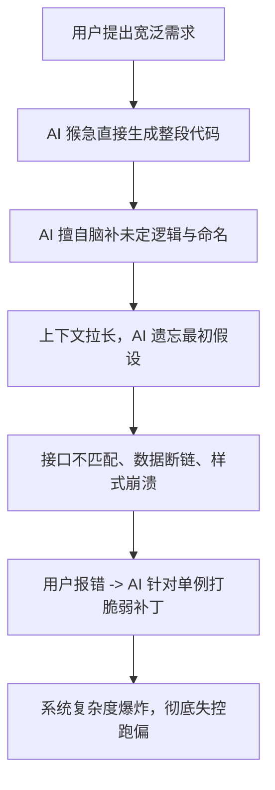

# 通用 AI 辅助软件开发全流程防跑偏工程指南与提示词手册

> 本手册提炼自复杂系统（含多模态 AI 与确定性工程混合架构）的研发踩坑与实战演进经验，旨在为任意从 0 到 1 的软件工程项目提供**结构化、可落地的防跑偏控轨机制**。

---

## 目录
1. [为什么 AI 辅助开发总是“高开低走”？（痛点复盘）](#一为什么-ai-辅助开发总是高开低走痛点复盘)
2. [防跑偏四大核心工程哲学](#二防跑偏四大核心工程哲学)
3. [【核心神器】项目启动通用元提示词（Master Prompt）](#三核心神器项目启动通用元提示词master-prompt)
4. [全生命周期分阶段推进指令手册（Phase 1 ~ Phase 5）](#四全生命周期分阶段推进指令手册phase-1--phase-5)
5. [动态纠偏应急咒语库（拉回跑偏 AI 的三板斧）](#五动态纠偏应急咒语库拉回跑偏-ai-的三板斧)
6. [实战对比表：跑偏开发 vs 控轨开发](#六实战对比表跑偏开发-vs-控轨开发)

---

## 一、为什么 AI 辅助开发总是“高开低走”？（痛点复盘）

很多团队在使用 AI（如 Claude, GPT, DeepSeek, Antigravity 等）开发项目时，往往第一天惊艳，第三天崩溃。其根本原因不在于大模型的代码生成能力，而在于**没有限制 AI 的发散天性**：



1. **“猴急综合征”（跳过契约直接写代码）**：
   需求还没讨论清楚，AI 就急不可耐地生成几百行代码。由于缺少数据协议（Schema），这几百行代码全凭 AI 当下的随机幻觉。
2. **“命名与意图飘移”（没有可信源）**：
   在没有强约束的情况下，同一个业务实体，AI 在 A 模块叫 `exchange_shop`，在 B 模块叫 `points_mall`，在 C 模块叫 `shop_modal`，最终导致全局状态、交互连线和数据库关联全面崩塌。
3. **“打补丁陷阱”（破窗效应）**：
   出现局部 Bug 时，开发者常说“这里不对，修一下”。AI 为了图快，往往写出形如 `if (name.contains("xxx"))` 的死逻辑，破坏了通用架构，让系统走向熵增。

---

## 二、防跑偏四大核心工程哲学

在开始任何项目前，必须让 AI 与开发者达成以下四项核心共识：

> [!IMPORTANT]
> ### 1. 严格阶段门禁（Phase Gates）
> 未经人类确认，AI **严禁跨阶段进入下一步**。特别是严禁在需求、契约未审查通过前输出任何业务实现代码。
> 
> ### 2. 契约先行（Contract-First）
> **先定模型与协议，后写具体实现**。数据库 DDL、API 接口定义（OpenAPI/JSON Schema）、状态机流转就是法律，写代码时必须 100% 遵守，严禁二次发挥。
> 
> ### 3. 零假设原则（Zero-Assumption）
> 严禁擅自做主脑补。遇到分歧、多套方案或业务模糊点，AI 必须停下来，列出利弊选项由人类决断。
> 
> ### 4. 确定性优先于概率性（Defensive Engineering）
> 凡是能够用确定性算法、数学公式、固定规则解决的事情（如网格对齐、坐标约束、CSS盒模型计算），**一个字都不要让大模型生成**。AI 只做模糊感知与语义提取，确定性程序负责布局与渲染。

---

## 三、【核心神器】项目启动通用元提示词（Master Prompt）

每次开启一个全新项目时，**第一条指令直接完整复制以下内容**。只需替换开头的【项目名称】与【核心需求与目标】：

````markdown
【项目名称】：[例如：多租户企业资产管理系统 / 自动化报表平台 / 独立游戏关卡编辑器]
【核心需求与目标】：[在此用简练的语言，描述2~3句最核心的业务目标与期望]

---

【最高开发准则（必须严格执行，违背则视为任务失败）】

你现在扮演顶级系统架构师兼全栈工程师。在本次项目的全生命周期中，你必须强制执行以下【防跑偏五大军规】：

1. 【严格阶段门禁（Phase Gates）——严禁越级】
   项目必须严格按顺序推进五个阶段：
   - 阶段一：需求对齐与边界澄清（Scope & PRD）
   - 阶段二：架构选型与数据契约设计（Architecture & Schema）
   - 阶段三：可落地的原子任务拆解（Task Breakdown）
   - 阶段四：模块化原子编码与可测性验证（Atomic Implementation）
   - 阶段五：系统集成与验收（Verification）
   👉 每一个阶段完成时，你必须停下来向我汇报并等待我回复“确认/通过”。未经我明确确认，严禁擅自进入下一阶段，严禁在前两个阶段直接输出业务实现代码！

2. 【零假设原则（Zero-Assumption）——严禁脑补】
   遇到任何业务边界模糊、技术选型有争议、命名规则未定或存在多种方案的地方，严禁擅自假定或做主。你必须主动列出选项（包含各自利弊与建议），等待我决断。

3. 【契约先行（Contract-First）——先协议后代码】
   在编写任何业务实现代码前，必须先确定：
   - 数据模型（DB Schema / Entity / JSON Schema）
   - 接口契约（API 协议、入参、出参、错误码）
   - 统一命名术语表（Naming Glossary）与状态机
   契约一经我确认，后续代码编写必须100%严格遵守，严禁在编码时临时变造字段名或返回结构。

4. 【确定性与防御性设计（Defensive Engineering）】
   - 严格区分业务主逻辑与通用兜底，严禁编写针对特定测试数据的临时硬编码（Hardcode Hack）；
   - 所有输入输出必须具备边界校验与容错；
   - 系统核心管线必须支持“零 Token/零大模型成本的本地确定性重算或重新渲染”。

5. 【上下文防漂移机制（State Tracking）】
   在后续所有的交互中，每次给出方案或代码前，简要声明当前处于哪个阶段、正在处理哪个任务编号，确保开发节奏始终在同一条轨道上。

---

【当前执行第一步】：
请不要写任何业务代码，只针对我的需求进行深度思考，并输出：
1. 《核心业务需求拆解与系统边界定义（明确做什么、绝不做什么）》
2. 《核心实体概念与统一命名术语表（Naming Glossary）》
3. 《当前未明确的关键痛点与设计疑问清单（待我确认）》
等待我的确认后，我们再进入架构设计阶段。
````

---

## 四、全生命周期分阶段推进指令手册（Phase 1 ~ Phase 5）

在使用上述 Master Prompt 启动后，AI 会输出需求拆解。之后你只需要按序发出以下精简指令，即可像“项目经理验收里程碑”一样一步步推进：

### 阶段一：需求澄清与边界定义（PRD & Scope）
* **AI 交付物**：业务边界清单（In-Scope / Out-of-Scope）、术语表、未决问题清单。
* **人类审核重点**：
  * 有没有把不该做的高复杂度功能包揽进来？
  * 术语表中的中英文对照是否精准且唯一？
* **放行标准**：所有疑问均已回答并达成一致。

---

### 阶段二：技术选型与协议契约设计（Architecture & Schema）
* **你的推进指令**：
  ```markdown
  需求已确认通过。现在进入【阶段二：架构与契约设计】。
  请输出：
  1. 技术栈选型建议（对比至少 2 种主流方案，列出优劣势与你的推荐理由）；
  2. 系统分层架构图与核心数据流向图（Mermaid 格式）；
  3. 核心数据库 DDL（或 JSON Schema 契约），需包含字段类型、主外键与注释；
  4. 统一 API 接口契约列表（包含路径、入参、出参结构、标准响应包裹与错误码）；
  5. 状态流转图（如有订单、生命周期、交互模式等状态机）。
  【限制】：仍然不要输出具体业务代码，等待我审查契约。
  ```
* **人类审核重点**：
  * 字段命名是否沿用了阶段一的术语表？
  * API 协议是否完备？有没有缺少异常响应？
  * 架构选型是否过度设计（Over-engineering）？

---

### 阶段三：原子化任务拆解（Task Breakdown）
* **你的推进指令**：
  ```markdown
  契约已确认通过。现在进入【阶段三：任务拆解与开发计划】。
  请根据已批准的架构与契约，按依赖关系将系统拆解为独立的原子任务清单（Task 1, Task 2...）。
  每个 Task 必须包含：
  - 任务名称与目标
  - 前置依赖任务
  - 涉及的文件路径（新增/修改）
  - 输入、输出与使用的接口/数据模型
  - 明确的自测验收标准（Definition of Done）
  请输出任务拆解矩阵，等待我确认开发顺序。
  ```
* **人类审核重点**：
  * 任务粒度是否足够小（每个任务代码量控制在 100~300 行以内）？
  * 依赖顺序是否合理（基础配置 -> 实体层 -> 数据访问 -> 核心服务 -> 控制器/API -> 前端界面）？

---

### 阶段四：模块化原子编码与可测性验证（Atomic Implementation）
* **你的推进指令**（每个 Task 单独执行一次）：
  ```markdown
  任务清单已确认。现在开始执行【Task [编号]: [任务名称]】。
  【编写军规】：
  1. 只编写该任务范围内的文件，严禁修改无关代码；
  2. 100% 严格遵守阶段二制定的命名规范与 Schema 契约；
  3. 提供可执行的单元测试、验证脚本或 curl 测试命令，证明该模块达到验收标准；
  4. 完成后停下来，输出自测结果并等待我验证通过，再进行下一个 Task。
  ```
* **人类审核重点**：
  * 运行提供的验证脚本，检查输出是否符合预期。
  * 确保没有写死的 mock 数据或针对单例的特殊分支。

---

### 阶段五：集成串联与端到端交付（Verification）
* **你的推进指令**：
  ```markdown
  所有单个 Task 已完成。现在进入【阶段五：系统集成与端到端验收】。
  请输出：
  1. 端到端完整链路的联调验证脚本或操作指引；
  2. 部署与启动环境说明；
  3. 全生命周期架构与契约符合度总结。
  让我们运行集成测试。
  ```

---

## 五、动态纠偏应急咒语库（拉回跑偏 AI 的三板斧）

在复杂对话中，大模型偶尔会发生上下文漂移或自作主张。一旦发现苗头，**无需大段争论，直接复制以下对应的标准纠偏咒语**：

### 咒语 1：接口契约或命名漂移时（踩刹车）
> **咒语**：
> 「**暂停！你正在偏离阶段二制定的数据契约。** 回到我们统一的术语表和 API 规范，不要擅自更改字段名、枚举值或返回体格式。请严格按照已批准的契约重新修正代码并说明差异。」

### 咒语 2：针对单例打脆弱补丁时（防破窗）
> **咒语**：
> 「**注意：严禁写针对当前测试样本的特殊硬编码（Hardcode Hack）。** 请从通用数据模型、状态机或通用算法层面分析为什么会出现这个异常，并在底层抽象上提供全局通用的鲁棒解法，保证同类场景全部自愈。」

### 咒语 3：长上下文失忆、逻辑混乱时（重启对齐）
> **咒语**：
> 「**立刻停止输出。** 鉴于上下文过长，我们现在进行一次轨道校准。请重新列出：
> 1. 当前处于哪个阶段，正在处理哪个原子任务？
> 2. 已确认且绝不可更改的核心契约是什么？
> 3. 当前遇到的核心技术障碍是什么？给出 2 个标准解决方案供我选择。」

---

## 六、实战对比表：跑偏开发 vs 控轨开发

| 维度 | ❌ 容易跑偏的传统做法 |  控轨工程做法（本手册） |
| :--- | :--- | :--- |
| **项目起手** | “帮我做一个xx系统，技术用 Spring + Vue” | 投喂【Master Prompt】，锁死五大军规，首轮只做需求与边界分析 |
| **页面命名** | 让 AI 在分析过程中自由起名，造成同义词泛滥 | 阶段一先定《统一术语表》，确立唯一 Ground Truth |
| **接口定义** | 写前端时随手造假数据，写后端时按心情起字段名 | 阶段二先定 OpenAPI / JSON Schema 契约，前后端强校验 |
| **排查 Bug** | “这个地方不对，帮我改改” -> AI 堆砌 `if-else` 特判 | 阶段四要求“通用鲁棒算法”，坚决拦截针对测试数据的 hack |
| **开发节奏** | 一次性生成几千行代码，出了错无法定位 | 按阶段三的原子任务（Task），单模块写完即测，步步为营 |
| **Token 与成本** | 遇到样式对齐让大模型不断重写完整代码，成本上天 | 确定性逻辑完全剥离给规则引擎，零 Token 极速重算 |

---

### 建议保存方式
建议将本文档保存为团队内部的 `AI_DEVELOPMENT_SOP.md`。无论何时启动新项目，将其作为最高工程准则，AI 将从一个“难以预测的黑盒”彻底转变为“严谨听从指挥的高级研发团队”。
